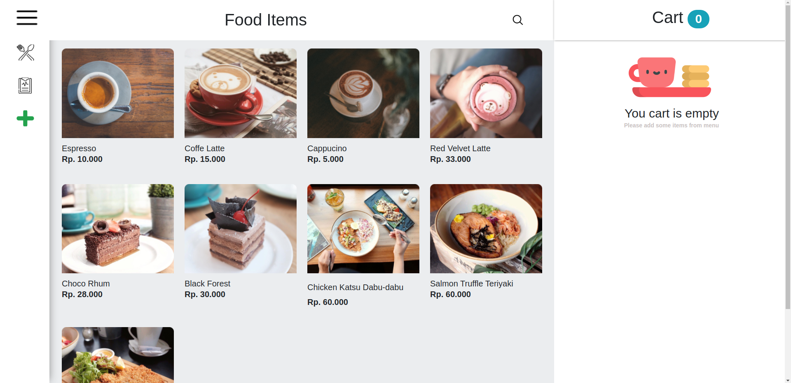

# Vuefrontend 

## Project setup
```
yarn install
```

### Compiles and hot-reloads for development
```
yarn serve
```

### Compiles and minifies for production
```
yarn build
```

### Lints and fixes files
```
yarn lint
```

### Customize configuration
See [Configuration Reference](https://cli.vuejs.org/config/).

# frontvuecoffeshop

## This project use Dependencies:
1. "axios": "^0.21.0",
2. "bootstrap-vue": "^2.17.3",
3. "core-js": "^3.6.5",
4. "dotenv": "^8.2.0",
5. "dotenv-webpack": "^6.0.0",
6. "vue": "^2.6.11",
7. "vue-router": "^3.2.0",
8. "vuex": "^3.6.0",
9. "vuex-persistedstate": "^4.0.0-beta.2"


## Database use:
1. user
2. products
3. history
4. category
